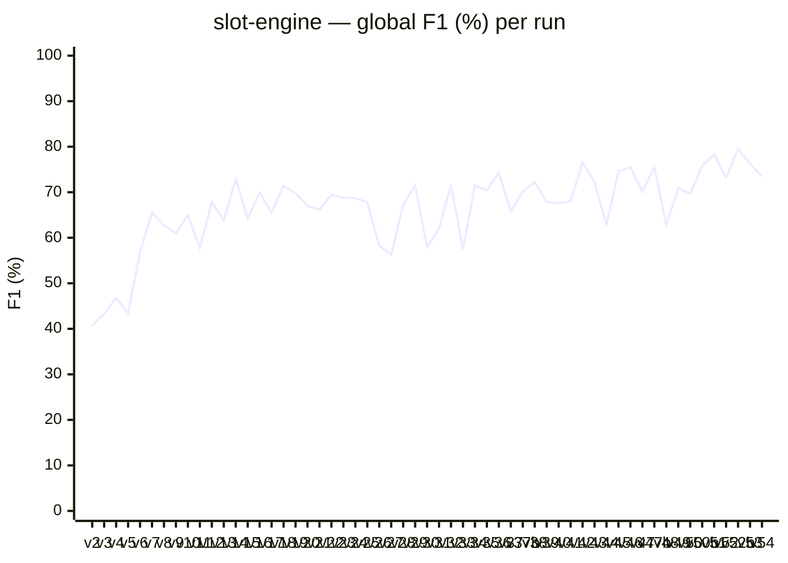
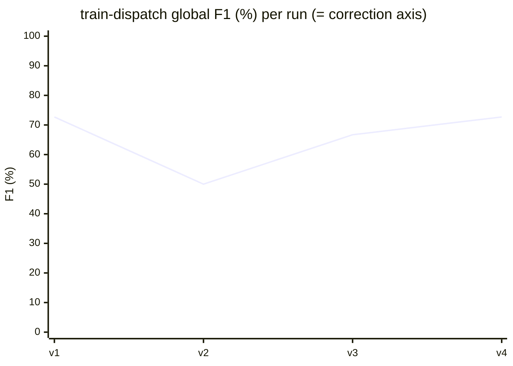

# anatoly-bench

Benchmark suite for the [Anatoly](https://github.com/r-via/anatoly) code audit agent.

Each fixture in `catalog/` is a self-contained project seeded with a curated set of defects — business-invariant violations, technical bugs, dead code, semantic duplicates, over-engineered abstractions, missing tests, missing documentation. Running Anatoly on a fixture produces a sharded report; `anatoly-bench` parses that report, matches findings against the fixture's ground-truth catalog, and returns a per-axis F1 score.

A perfect audit is a 1-for-1 match: every cataloged defect flagged, no spurious findings, correct axis and verdict on each one.

## Relationship to Anatoly

`anatoly-bench` does not import any code or types from Anatoly. It consumes only Anatoly's public artifacts — the sharded report files and `run-metrics.json` emitted under `.anatoly/` — via the filesystem. This makes the report layout a public contract: any breaking change in Anatoly's output format will surface here.

## Layout

```
anatoly-bench/
├── src/                  # scorer, parser, CLI
│   ├── cli.ts            # anatoly-bench entrypoint
│   ├── spec-parser.ts    # reads SPEC.md, extracts the YAML catalog
│   ├── parser.ts         # reads Anatoly's sharded report
│   ├── score.ts          # bipartite matching + F1 per axis
│   └── types.ts          # shared types
├── catalog/
│   └── slot-engine/      # first fixture — see its SPEC.md
│       ├── SPEC.md              # ground truth (never enters project/; never seen by Anatoly)
│       ├── verify.sh            # Evolve --check script
│       ├── verify-runtime.mts   # Monte-Carlo harness invoked by verify.sh
│       └── project/             # the code Anatoly audits
│           ├── package.json     # seed
│           ├── tsconfig.json    # seed
│           ├── README.md        # seed (neutral, user-facing; contains DOC-RENAMED-API)
│           └── src/             # generated by Evolve
└── baselines/            # snapshots of past scores for regression diffs
```

## Workflow

### 1. Generate a fixture (rare — only when the SPEC changes)

The fixture's code is generated by [Evolve](https://github.com/r-via/evolve) from `SPEC.md`. Evolve reads the spec via its `--spec` flag, so `SPEC.md` stays physically outside `project/` and never enters the directory Anatoly audits.

```bash
cd catalog/slot-engine

# Evolve reads ../SPEC.md as spec, project/ as working tree.
# project/README.md is already seeded (neutral, user-facing) — do not replace it.
evolve start project --spec ../SPEC.md --check ../verify.sh --rounds 30

# Commit the generated project
git add project
git commit -m "fixture(slot-engine): regenerate"
```

### 2. Audit with Anatoly

```bash
cd catalog/slot-engine/project
anatoly run
```

### 3. Score

```bash
anatoly-bench score \
  --spec catalog/slot-engine/SPEC.md \
  --report catalog/slot-engine/project/.anatoly/report
```

Output is a per-axis F1 breakdown, a list of misses (cataloged defects Anatoly failed to find), and a list of false positives (findings without a matching expectation).

## Scoring

For each axis, findings are matched against expected violations using bipartite matching on `(file, line ± tolerance, expected_verdict)`. Project-wide expectations (e.g. "no test suite exists") match against any finding on the matching axis regardless of file. Scores are reported as:

- per-axis **precision**, **recall**, **F1**
- global **F1** as the unweighted mean of per-axis F1s
- a **weighted F1** secondary indicator using difficulty weights (`trivial=1`, `medium=2`, `hard=3`)

A perfect audit scores `1.0`. In practice, the target is movement over time — each change to Anatoly's prompts or models is measured against the previous baseline.

## Current results — `slot-engine` fixture



Best run to date: **v52b at 79.5%** (2026-06-11). The code surface and ground-truth catalog have been fixed since v16 (`project` @ `7dc4cc6`), so every v16→v54 delta is pure Anatoly behaviour (prompt/model/runtime changes plus run-to-run LLM variance — `v36`–`v41` are A/B prompt+model experiments, `*b` suffixes are sister reruns). Treat any single-run move under ~9pp as inside the noise floor.

Full per-axis curves, change-log of Anatoly fixes, per-axis execution profile, and remaining misses → [docs/02-slot-engine-results.md](./docs/02-slot-engine-results.md). Per-run baselines → [`baselines/`](./baselines/). Roadmap → [ROADMAP.md](./ROADMAP.md).

## Current results: `train-dispatch` fixture



Best run to date: **v1 / v4 at 72.7%** (2026-06-15). `train-dispatch` is the behavioural-invariant companion to `slot-engine`: 6 cataloged defects on a **single scored axis** (correction), so global F1 equals the correction-axis F1 and one caught-or-missed defect moves it by ~10 to 12 points. The fixture is new (all four runs from 2026-06-15) and the code surface was still converging from v1 to v3; v4 runs on the frozen final state (`60bdb75`) and isolates the Anatoly-side RAG declaration-indexing fix. Two defects are missed on every run: INV-DWELL (detected but classified as a doc-divergence rather than a correction defect) and INV-DEADLOCK (requires multi-train execution-trace reasoning).

Per-run narrative, the declaration-indexing fix, and remaining misses → [docs/05-train-dispatch-results.md](./docs/05-train-dispatch-results.md). Per-run baselines → [`baselines/`](./baselines/).

## License

AGPL-3.0-only.
