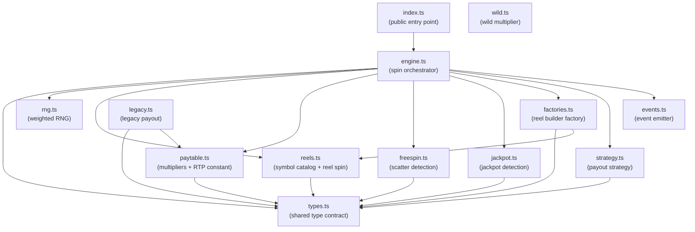

# System Overview

> High-level diagram and component responsibilities for the slot-engine module architecture.

## Overview

`slot-engine` is composed of thirteen focused TypeScript modules wired together by `engine.ts`, which orchestrates one full spin per call to `spin()`. The library follows standard object-oriented design patterns — a lightweight dependency-injection container, a factory for reel construction, a strategy for payout adjustment, and a pub-sub event emitter for spin lifecycle hooks — all layered on top of a shared type contract defined in `types.ts`.

For a feature-level description of what the engine does during a spin, see [Overview](../01-Getting-Started/01-Overview.md).

## Module Map

The diagram below shows the compile-time import graph. Arrows point from importer to imported module.



`types.ts` is the dependency root — eight modules import from it. `wild.ts` is a standalone utility with no imports; it is called directly by `engine.ts` but is not shown in the graph above because it is not imported as a module dependency in the current implementation.

## Module Responsibilities

| Module | Exported surface | Responsibility |
|---|---|---|
| `index.ts` | `spin`, `Bet`, `SpinResult` | Public package entry point; re-exports from `engine.ts` |
| `engine.ts` | `spin`, `computePayout`, `EngineContainer` | Orchestrates one full spin; hosts the DI container |
| `types.ts` | `Symbol`, `LineWin`, `FreeSpinState`, `SpinResult` | Shared TypeScript type contract for all modules |
| `rng.ts` | `weightedPick` | Cumulative-weight random selection used by reel spinning |
| `reels.ts` | `spinReel`, `getReelSymbols`, `getReelWeights`, `REEL_WEIGHTS` | Eight-symbol catalog; per-reel weight configuration; produces three-row symbol columns |
| `paytable.ts` | `getPayMultiplier`, `lineWins`, `ANCIENT_RTP` | Payout multiplier lookup table; `ANCIENT_RTP = 0.95` |
| `wild.ts` | `applyWildBonus` | Applies the exponential wild multiplier: `(1 + wildCount) × 2^wildCount` |
| `freespin.ts` | `detectScatters`, `handleFreeSpins` | Counts `SCATTER` symbols; state-machine for awarding and tracking free spins |
| `jackpot.ts` | `isJackpotHit` | Returns `true` when four or more `DIAMOND` symbols appear on the grid |
| `factories.ts` | `StandardReelBuilderFactory`, `AbstractReelBuilderFactory` | Factory pattern wrapper around `spinReel`; builds the full five-reel grid |
| `strategy.ts` | `DefaultStrategy`, `ConservativeStrategy`, `SpinStrategy` | Strategy pattern for post-calculation payout adjustment; `ConservativeStrategy` applies a 0.8× factor |
| `events.ts` | `SpinEventEmitter`, `SPIN_DONE` | Lightweight pub-sub emitter; `engine.ts` emits `SPIN_DONE` after every spin |
| `legacy.ts` | `computeLegacyPayout` | Retained for compatibility; not called by the current spin pipeline |

## Architectural Patterns

### Dependency Injection — `EngineContainer`

`engine.ts` exposes a minimal DI registry with `register(key, value)` and `resolve<T>(key)`. Internal services (the reel factory, payout strategy, and event emitter) are registered at module initialisation and resolved by `spin()` at call time. This allows test code or advanced integrators to substitute implementations without modifying `engine.ts`.

### Factory — `AbstractReelBuilderFactory`

Reel construction is isolated behind an abstract factory. `StandardReelBuilderFactory` implements `buildReels(reelCount, rowCount)` by delegating to `spinReel` for each reel index. A custom factory can be registered with `EngineContainer` to produce deterministic grids for testing.

### Strategy — `SpinStrategy`

Post-calculation payout adjustment is encapsulated in a strategy object. `DefaultStrategy` is a pass-through. `ConservativeStrategy` multiplies the payout by `0.8`. `engine.ts` resolves the active strategy from `EngineContainer` and applies it as the final step before returning.

### Pub-Sub — `SpinEventEmitter`

`events.ts` provides a typed event emitter. `engine.ts` emits `SPIN_DONE` with the completed `SpinResult` at the end of every spin. Consumers that require post-spin hooks (logging, analytics, free-spin chaining) should subscribe via `SpinEventEmitter` rather than wrapping `spin()`.

## Examples

The following example shows a single spin and maps each field of `SpinResult` back to the module that produced it:

```typescript
import { spin } from "slot-engine";

const result = spin(25); // 25-coin bet

// Produced by factories.ts + reels.ts via spinReel()
console.log("Grid (5 reels × 3 rows):", result.reels);

// Produced by paytable.ts lineWins() evaluated over PAYLINES
console.log("Payline wins:", result.lineWins);
// e.g. [{ lineIndex: 2, symbol: "BELL", count: 4, payout: 250 }]

// Produced by wild.ts applyWildBonus()
console.log("Wild multiplier applied:", result.wildMultiplier);

// Produced by freespin.ts detectScatters()
console.log("Scatter symbols on grid:", result.scatterCount);

// Produced by freespin.ts handleFreeSpins()
console.log("Free spins awarded:", result.freeSpinsAwarded);

// Produced by jackpot.ts isJackpotHit()
console.log("Jackpot triggered:", result.jackpotHit);

// Produced by engine.ts computePayout() after strategy.ts adjustment
console.log("Total payout (coins):", result.totalPayout);
```

Running many spins and summing payouts should converge on approximately 95% of total coins wagered, reflecting the `ANCIENT_RTP = 0.95` constant in `paytable.ts`.

```typescript
import { spin } from "slot-engine";

const BET = 10;
const ROUNDS = 100_000;
let totalWagered = 0;
let totalReturned = 0;

for (let i = 0; i < ROUNDS; i++) {
  totalWagered += BET;
  totalReturned += spin(BET).totalPayout;
}

const empiricalRTP = totalReturned / totalWagered;
console.log(`Empirical RTP after ${ROUNDS} spins: ${(empiricalRTP * 100).toFixed(2)}%`);
// Expected: approximately 95.00%
```

## See Also

- [Core Concepts](02-Core-Concepts.md) — glossary of domain terms (payline, scatter, wild, RTP)
- [Data Flow](03-Data-Flow.md) — step-by-step trace of data through a single `spin()` call
- [Design Decisions](04-Design-Decisions.md) — rationale for the factory, strategy, and DI patterns
- [Public API](../04-API-Reference/01-Public-API.md) — full signature reference for `spin()` and `computePayout()`
- [Types and Interfaces](../04-API-Reference/03-Types-and-Interfaces.md) — `SpinResult`, `LineWin`, `FreeSpinState`, and all exported types
- [Source Tree](../05-Development/01-Source-Tree.md) — annotated listing of every file under `src/`