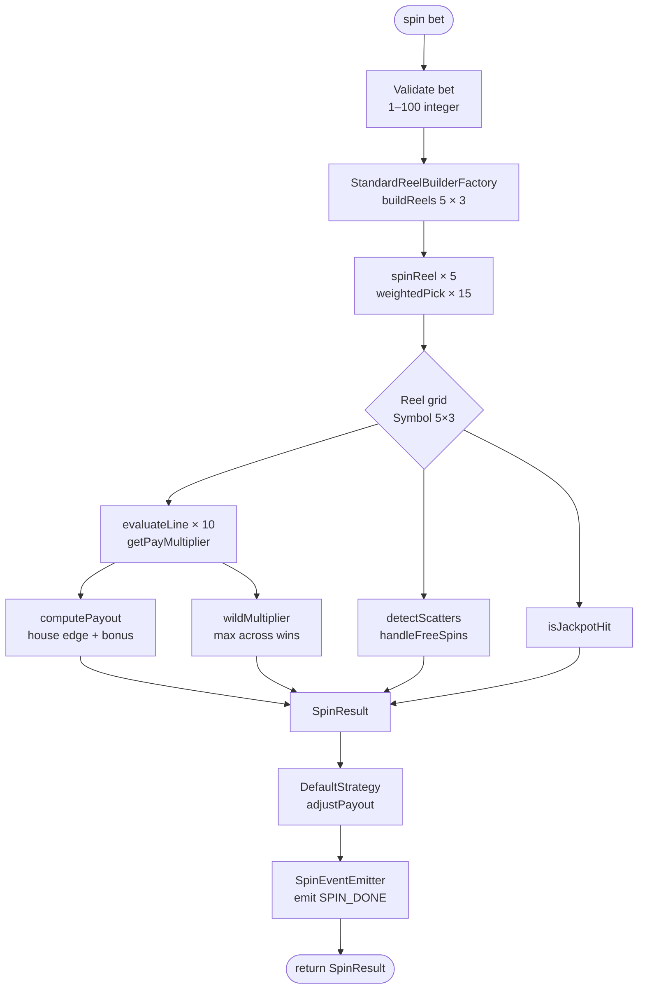
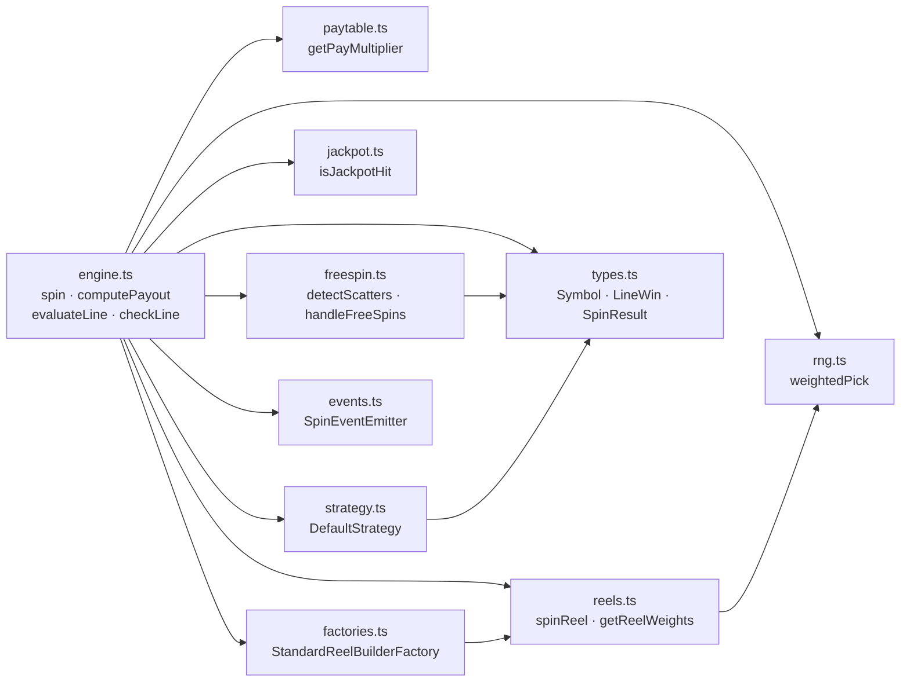

# Data Flow

> Traces the path of a single spin through the slot-engine pipeline, from bet validation to the returned `SpinResult`.

## Overview

When `spin(bet)` is called, the engine executes a deterministic sequence of six stages: input validation, reel construction, payline evaluation, bonus detection, payout calculation, and result assembly. Each stage is handled by a dedicated module; data passes forward as plain TypeScript values — no shared mutable state, no I/O. Understanding this pipeline is essential for reasoning about RTP, win frequency, and the contribution of wilds, scatters, and the jackpot.

## Pipeline Stages

The full pipeline is illustrated below, followed by per-stage detail.



### Stage 1 — Input Validation (`engine.ts`)

`spin()` rejects any bet that is not a positive integer in the range 1–100. A warning is logged when the bet exceeds 100, but execution continues.

```typescript
spin(0);    // throws "invalid bet"
spin(1.5);  // throws "invalid bet"
spin(101);  // console.warn, continues
```

### Stage 2 — Reel Construction (`factories.ts`, `reels.ts`, `rng.ts`)

`StandardReelBuilderFactory.buildReels(5, 3)` calls `spinReel(i)` once for each of the five reel columns. Each call invokes `pickFromWeighted` three times — once per row — against the column's weight table.

**Symbol weights (identical for all five reels):**

| Symbol  | Weight | Approx. frequency |
|---------|--------|-------------------|
| DIAMOND | 30     | 25.0 %            |
| CHERRY  | 25     | 20.8 %            |
| LEMON   | 25     | 20.8 %            |
| BELL    | 15     | 12.5 %            |
| BAR     | 10     | 8.3 %             |
| SEVEN   | 5      | 4.2 %             |
| WILD    | 5      | 4.2 %             |
| SCATTER | 5      | 4.2 %             |

The result is a `Symbol[][]` — five columns, three rows — held in `reels`.

### Stage 3 — Payline Evaluation (`engine.ts`, `paytable.ts`)

The engine defines ten hardcoded paylines, each a five-element row-index array mapping column → row:

```typescript
const PAYLINES: number[][] = [
  [1, 1, 1, 1, 1],  // middle row
  [0, 0, 0, 0, 0],  // top row
  [2, 2, 2, 2, 2],  // bottom row
  [0, 1, 2, 1, 0],  // V shape
  [2, 1, 0, 1, 2],  // inverted V
  [0, 0, 1, 2, 2],  // diagonal down
  [2, 2, 1, 0, 0],  // diagonal up
  [1, 0, 1, 2, 1],  // zigzag
  [1, 2, 1, 0, 1],  // zigzag inverted
  [0, 1, 0, 1, 0],  // skip pattern
];
```

For each payline, `evaluateLine()` reads five symbols from the grid and calls `checkLine()`:

- The **lead symbol** is determined: if column 0 holds a WILD, the first non-WILD symbol becomes the lead.
- A consecutive run is counted left-to-right; WILDs extend the run as any symbol.
- A run of fewer than three produces no win.

When a run of three or more is found, `getPayMultiplier(symbol, count)` looks up the base multiplier and the line bet (`bet / 10`) is applied:

```
lineBet = bet / 10
basePayout = getPayMultiplier(symbol, run) × lineBet
```

**Paytable multipliers:**

| Symbol  | 3-of-a-kind | 4-of-a-kind | 5-of-a-kind |
|---------|-------------|-------------|-------------|
| CHERRY  | 2           | 5           | 25          |
| LEMON   | 2           | 5           | 25          |
| BELL    | 5           | 20          | 100         |
| BAR     | 10          | 40          | 200         |
| SEVEN   | 25          | 100         | 500         |
| DIAMOND | 50          | 250         | 1 000       |

#### Wild Multiplier (applied inline)

If WILDs are present in the winning run, `evaluateLine()` escalates the payout using the formula from `applyWildBonus()` in `wild.ts`:

```
payout = basePayout × (1 + wildCount) × 2^wildCount
```

| WILDs in run | Multiplier factor |
|---|---|
| 1 | × 4  |
| 2 | × 12 |
| 3 | × 32 |

The highest wild-multiplier factor observed across all winning lines is returned as `SpinResult.wildMultiplier`.

### Stage 4 — Bonus Detection (`freespin.ts`, `jackpot.ts`)

Both bonus checks scan the entire 5×3 grid independently of paylines.

**Scatter / free spins (`freespin.ts`)**

`detectScatters(reels)` counts every cell containing `"SCATTER"`. The count is passed to `handleFreeSpins(state, scatterCount)`:

- 3 or more scatters on a non-active state → `state.remaining = 10`, `state.active = true`
- 3 or more scatters on an already-active state → `state.remaining += 10`
- Spin during active state with fewer than 3 scatters → `state.remaining--`

`SpinResult.freeSpinsAwarded` is set to `state.remaining` after this call.

**Progressive jackpot (`jackpot.ts`)**

`isJackpotHit(reels)` counts `"DIAMOND"` cells. Four or more diamonds anywhere on the grid sets `SpinResult.jackpotHit = true`.

### Stage 5 — Payout Calculation (`engine.ts`)

`computePayout(lineWins, bet)` aggregates the line-level payouts and applies the house edge:

```
total = Σ lineWin.payout
if total > 0:
    total = total × 1.05      // house edge baked in as +5 % on wins
total += bet × 0.01           // minimum return on every spin
return Math.ceil(total)
```

The 5% uplift on gross wins, combined with the base-return floor, targets the 95% theoretical RTP documented in the README.

### Stage 6 — Result Assembly and Dispatch (`engine.ts`, `strategy.ts`, `events.ts`)

The engine constructs a `SpinResult` value, then passes it through the strategy and event layers:

1. **`DefaultStrategy.adjustPayout(result)`** — returns the result unchanged. The `ConservativeStrategy` alternative (defined in `strategy.ts`) reduces `totalPayout` by 20% but is not wired into the default pipeline.
2. **`SpinEventEmitter.emit(SPIN_DONE, finalResult)`** — fires the `"spin:done"` event with the finished result. No built-in listeners are registered; consumers may subscribe via `emitter.on`.

## Module Dependency Graph



## Examples

### Tracing a winning spin step by step

```typescript
import { spin } from "slot-engine";

// Place a 10-coin bet.
// lineBet = 10 / 10 = 1 coin per payline.
const result = spin(10);

// Inspect the raw grid (5 columns × 3 rows).
console.log("Reels:", result.reels);

// Each LineWin shows which payline fired, the matched symbol,
// run length, and the pre-aggregation payout for that line.
for (const win of result.lineWins) {
  console.log(
    `Payline ${win.lineIndex}: ${win.count}× ${win.symbol} → ${win.payout} coins`
  );
}

// The wild multiplier is the maximum (1 + wildCount) × 2^wildCount
// factor observed across all winning lines this spin.
console.log("Wild multiplier:", result.wildMultiplier);

// Scatter count covers the whole 5×3 grid, not just paylines.
console.log("Scatters visible:", result.scatterCount);

// 10 free spins are awarded if scatterCount >= 3.
console.log("Free spins awarded:", result.freeSpinsAwarded);

// Jackpot fires when 4+ DIAMOND symbols appear anywhere.
console.log("Jackpot hit:", result.jackpotHit);

// totalPayout = Math.ceil(Σ lineWin.payout × 1.05 + bet × 0.01)
console.log("Total payout:", result.totalPayout);
```

### Verifying the house-edge formula

```typescript
import { computePayout } from "slot-engine";
import type { LineWin } from "slot-engine";

const fakeWins: LineWin[] = [
  { lineIndex: 0, symbol: "SEVEN", count: 3, payout: 25 },
];

// Gross win = 25.  After house edge: Math.ceil(25 × 1.05 + 10 × 0.01)
// = Math.ceil(26.25 + 0.10) = Math.ceil(26.35) = 27 coins.
const payout = computePayout(fakeWins, 10);
console.log(payout); // 27
```

## See Also

- [System Overview](02-Architecture/01-System-Overview.md) — component responsibilities and top-level architecture
- [Core Concepts](02-Architecture/02-Core-Concepts.md) — definitions for Symbol, payline, wild, scatter, and jackpot
- [Design Decisions](02-Architecture/04-Design-Decisions.md) — rationale behind the pipeline structure and house-edge formula
- [Public API](04-API-Reference/01-Public-API.md) — `spin()` signature and return value contract
- [Types and Interfaces](04-API-Reference/03-Types-and-Interfaces.md) — full `SpinResult`, `LineWin`, and `FreeSpinState` definitions