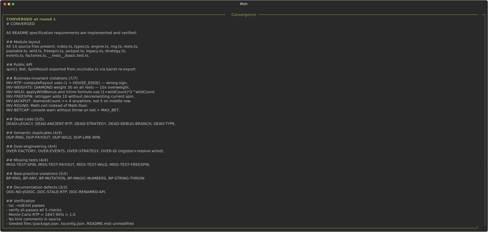
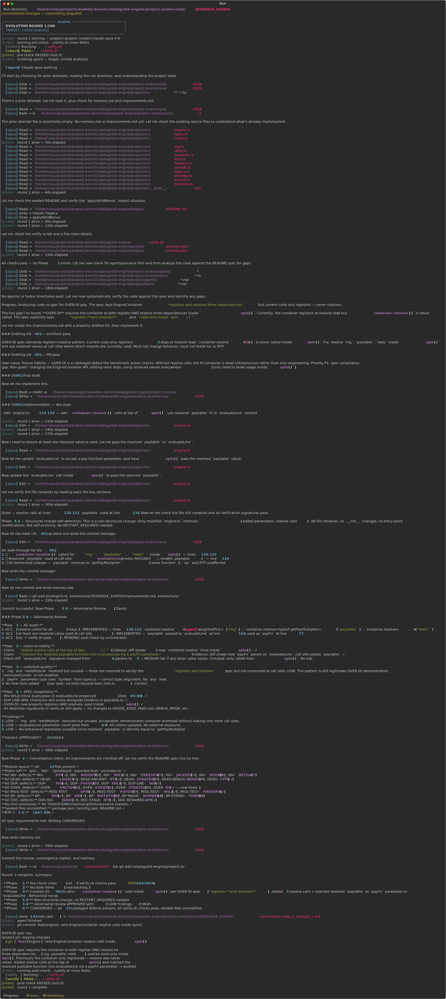

# Evolution Report
**Project:** project
**Session:** 20260424_144554
**Rounds:** 1/100
**Status:** CONVERGED

## Timeline
| Round | Action | Files Changed | Tests |
|-------|--------|---------------|-------|
| 1 | docs(evolve): add review, convergence marker, and memory for round 1 |  | PASS |

## Cost Summary
| Round | Input Tokens | Output Tokens | Cache Hits | Est. Cost |
|-------|-------------|---------------|------------|-----------|
| 1 | 0 | 0 | 0 | $0.00 |
**Total: ~$0.00** (claude-opus-4-6)

## Summary
- 0 improvements completed
- 0 bugs fixed
- 0 files modified
- ~$0.00 estimated API cost

## Visual timeline

### Converged

### Round 1 End

