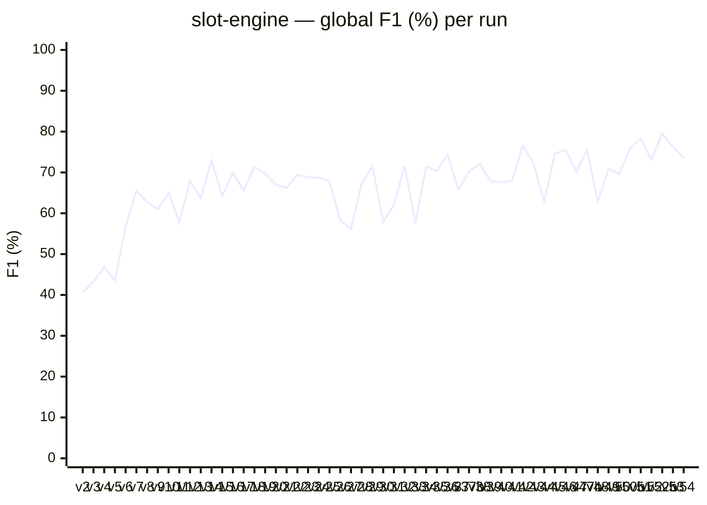
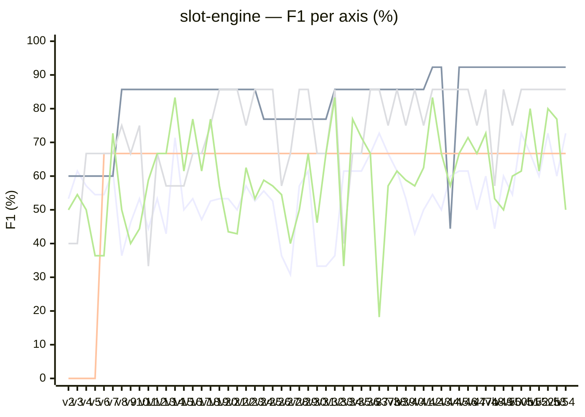

# slot-engine — bench results

Detailed progression of Anatoly scores on the `slot-engine` fixture (27 cataloged defects across 5 scored axes — correction:7, utility:7, duplication:4, overengineering:4, best-practices:5; tests and documentation intentionally excluded — the fixture ships no test suite or JSDoc by design).

Each run is a single execution of `anatoly run` against `catalog/slot-engine/project/`, scored via `anatoly-bench score`. Per-run JSON + Markdown baselines are in [`baselines/`](../baselines/).

## Global F1 progression

**The code surface and ground-truth catalog are frozen at `project` @ `7dc4cc6` from v16 onward** — every v16→v54 point is the same 27-defect fixture, so all movement is Anatoly behaviour (prompt / model / runtime changes) plus run-to-run LLM variance. v26→v54 push the ceiling up: the historical best moves from v14's 72.9% to **v52b's 79.5%** (2026-06-11), with v51 (78.3%), v42 (76.5%), v53 (76.3%) and the v45/v46/v47b/v50b cluster (74–76%) all clearing the old v14 high-water mark. `v36`–`v41` are A/B prompt+model experiments (the `-exp-*` / `-opus` / `-self-fix` suffixes), **not** a linear progression — `v37-exp-4.BD`'s 65.8% is an experiment that tanked best-practices to 18.2%, not a regression of record. `*b` suffixes (`v37b`, `v47b`, `v50b`, `v52b`) are sister reruns of the same Anatoly state; the spread between a version and its `b` twin (v50 69.7% vs v50b 75.8%, v52 73.2% vs v52b 79.5%) re-confirms the noise floor below. Detail per era → [v26→v54 change-log](#anatoly-changes-during-the-v26v54-era) below.

The 9pp spread across v13 → v15 (63.8% → 72.9% → 64.2%) on a fixed code state defines the **run-to-run LLM noise floor**. Treat any single-run delta below this band as noise. v18 → v22 trace the epic 55 (doc-conflicts arbitration loop) landing — see [Epic 55 detail](#epic-55--doc-conflicts-arbitration-loop-v18--v22) below. v23 is the first run post-epic-56 (unified phase + resource orchestration runtime, with `axes.correction` split into `pass1` + `verify` primitives and `doc-conflict-detection` split into `bootstrap` + `update`); global F1 lands within ±0.01 of v22 (68.8% vs 69.4%), confirming the refactor is F1-neutral. v24 is the first run on the epic-56-followup branch (writeCostSummary + writeCostVariance wired, EventEmitter.defaultMaxListeners ESM-safe fix) — F1 essentially identical to v23 (68.7%), zero MaxListenersExceededWarning (vs 5 in v23), and `costs/summary.json` + `costs/variance.json` now produced (though their `byComposer` / `byPrimitive` buckets are empty because the registry executor is not yet wired into the runtime — Story 56.11).

## Per-axis F1 progression

Five lines overlaid — Mermaid auto-assigns colors and shows the axis name as legend on each line. Crosswise patterns to note: **utility** steps from 60% to 85.7% at v8 (per-axis triage fix), then to a new **92.3% ceiling from v42 onward** (precision gain — utility FPs eliminated); the lone v44 crater to 44.4% is the AST import-extraction refactor breaking the usage graph for one run (recovered at v45). **duplication** stepped from 0 to 66.7% at v6 and has stayed **dead flat at 66.7% for 49 straight runs** — DUP-PAYOUT and DUP-WILD remain structurally out of reach (see misses). **correction** is the most volatile: dips to 30.8% (v27) and 33.3% (v30/v31), but also sets new highs at **72.7% (v37b-experiment, v50b, v52b, v54)**, beating v14's old 71.4%. **overengineering** consolidates an **85.7% plateau** across the v42→v54 era (with variance dips to 75% and one v33 collapse to 40%). **best-practices** keeps the widest dynamic range (18.2% in the failed v37-exp-4.BD experiment up to 83.3% at v32/v42) — still the dominant source of run-to-run F1 swing.

## Tabular baseline

Kept for data extraction / regression diffs. Bold marks historical peaks.

| Run | Date | Global F1 | correction | utility | duplication | overengineering | best-practices |
|-----|------|----------:|-----------:|--------:|------------:|----------------:|---------------:|
| v1* | 2026-04-24 | 27.7% | 53.3% | 60.0% | 0.0% | 0.0% | 40.0% |
| v2  | 2026-04-24 | 40.7% | 53.3% | 60.0% | 0.0% | 40.0% | 50.0% |
| v3  | 2026-04-24 | 43.2% | 61.5% | 60.0% | 0.0% | 40.0% | 54.5% |
| v4  | 2026-04-24 | 46.8% | 57.1% | 60.0% | 0.0% | 66.7% | 50.0% |
| v5  | 2026-04-24 | 43.5% | 54.5% | 60.0% | 0.0% | 66.7% | 36.4% |
| v6  | 2026-04-24 | 56.8% | 54.5% | 60.0% | **66.7%** | 66.7% | 36.4% |
| v7  | 2026-04-26 | 65.5% | 61.5% | 60.0% | 66.7% | 66.7% | **72.7%** |
| v7† | 2026-04-26 | 66.9% | 61.5% | 66.7% | 66.7% | 66.7% | 72.7% |
| v8  | 2026-04-27 | 62.7% | 36.4%‡ | **85.7%** | 66.7% | 75.0% | 50.0%‡ |
| v9  | 2026-04-27 | 61.0% | 46.2% | 85.7% | 66.7% | 66.7% | 40.0% |
| v10 | 2026-04-28 | 65.0% | 53.3% | 85.7% | 66.7% | 75.0% | 44.4% |
| v11 | 2026-04-28 | 57.8% | 44.4% | 85.7% | 66.7% | 33.3%§ | 58.8% |
| v12 | 2026-04-28 | 67.8% | 53.3% | 85.7% | 66.7% | 66.7% | 66.7% |
| v13 | 2026-05-06 | 63.8% | 42.9% | 85.7% | 66.7% | 57.1% | 66.7% |
| **v14**¶ | 2026-05-06 | **72.9%** | **71.4%** | 85.7% | 66.7% | 57.1% | **83.3%** |
| v15 | 2026-05-06 | 64.2% | 50.0% | 85.7% | 66.7% | 57.1% | 61.5% |
| **v16** | 2026-05-07 | **69.9%** | 53.3% | 85.7% | 66.7% | **66.7%** | 76.9% |
| v17  | 2026-05-12 | 65.5% | 47.1%◊ | 85.7% | 66.7% | 66.7% | 61.5% |
| v18  | 2026-05-12 | 71.4% | 52.6% | 85.7% | 66.7% | 75.0% | 76.9% |
| v19  | 2026-05-12 | 69.7%★ | 53.3% | 85.7% | 66.7% | **85.7%** | 57.1% |
| v20  | 2026-05-12 | 67.0% | 53.3% | 85.7% | 66.7% | 85.7% | 43.5% |
| v21  | 2026-05-12 | 66.2% | 50.0% | 85.7% | 66.7% | 85.7% | 42.9% |
| v22  | 2026-05-12 | 69.4% | **57.1%**☆ | 85.7% | 66.7% | 75.0% | 62.5% |
| v23  | 2026-05-13 | 68.8% | 52.6% | 85.7% | 66.7% | 85.7% | 53.3% |
| v24  | 2026-05-13 | 68.7% | 55.6% | 76.9% | 66.7% | 85.7% | 58.8% |
| v25  | 2026-05-14 | 67.8% | 52.6% | 76.9% | 66.7% | 85.7% | 57.1% |
| v26  | 2026-05-15 | 58.3% | 36.4% | 76.9% | 66.7% | 57.1% | 54.5% |
| v27  | 2026-05-17 | 56.2% | 30.8% | 76.9% | 66.7% | 66.7% | 40.0% |
| v28  | 2026-05-18 | 67.3% | 57.1% | 76.9% | 66.7% | 85.7% | 50.0% |
| v29  | 2026-05-18 | 71.5% | 61.5% | 76.9% | 66.7% | 85.7% | 66.7% |
| v30  | 2026-05-18 | 57.9% | 33.3% | 76.9% | 66.7% | 66.7% | 46.2% |
| v31  | 2026-05-18 | 62.1% | 33.3% | 76.9% | 66.7% | 66.7% | 66.7% |
| v32  | 2026-05-18 | 71.6% | 36.4% | 85.7% | 66.7% | 85.7% | **83.3%** |
| v33  | 2026-05-19 | 57.5% | 61.5% | 85.7% | 66.7% | 40.0% | 33.3% |
| v34  | 2026-05-19 | 71.5% | 61.5% | 85.7% | 66.7% | 66.7% | 76.9% |
| v35  | 2026-05-20 | 70.4% | 61.5% | 85.7% | 66.7% | 66.7% | 71.4% |
| v36ᵉ | 2026-05-20 | 74.3% | 66.7% | 85.7% | 66.7% | 85.7% | 66.7% |
| v37ᵉ | 2026-05-20 | 65.8% | **72.7%** | 85.7% | 66.7% | 85.7% | 18.2% |
| v37bᵉ| 2026-05-20 | 70.2% | 66.7% | 85.7% | 66.7% | 75.0% | 57.1% |
| v38ᵉ | 2026-05-20 | 72.2% | 61.5% | 85.7% | 66.7% | 85.7% | 61.5% |
| v39ᵉ | 2026-05-20 | 67.9% | 53.3% | 85.7% | 66.7% | 75.0% | 58.8% |
| v40ᵉ | 2026-05-20 | 67.6% | 42.9% | 85.7% | 66.7% | 85.7% | 57.1% |
| v41ᵉ | 2026-05-20 | 68.0% | 50.0% | 85.7% | 66.7% | 75.0% | 62.5% |
| v42  | 2026-06-04 | 76.5% | 54.5% | **92.3%** | 66.7% | 85.7% | 83.3% |
| v43  | 2026-06-04 | 72.3% | 50.0% | 92.3% | 66.7% | 85.7% | 66.7% |
| v44  | 2026-06-04 | 62.8% | 60.0% | 44.4%◆ | 66.7% | 85.7% | 57.1% |
| v45  | 2026-06-04 | 74.6% | 61.5% | 92.3% | 66.7% | 85.7% | 66.7% |
| v46  | 2026-06-11 | 75.5% | 61.5% | 92.3% | 66.7% | 85.7% | 71.4% |
| v47  | 2026-06-11 | 70.1% | 50.0% | 92.3% | 66.7% | 75.0% | 66.7% |
| v47b | 2026-06-11 | 75.5% | 60.0% | 92.3% | 66.7% | 85.7% | 72.7% |
| v48  | 2026-06-11 | 62.8% | 44.4% | 92.3% | 66.7% | 57.1% | 53.3% |
| v49  | 2026-06-11 | 70.9% | 60.0% | 92.3% | 66.7% | 85.7% | 50.0% |
| v50  | 2026-06-11 | 69.7% | 54.5% | 92.3% | 66.7% | 75.0% | 60.0% |
| v50b | 2026-06-11 | 75.8% | 72.7% | 92.3% | 66.7% | 85.7% | 61.5% |
| v51  | 2026-06-11 | 78.3% | 66.7% | 92.3% | 66.7% | 85.7% | 80.0% |
| v52  | 2026-06-11 | 73.2% | 60.0% | 92.3% | 66.7% | 85.7% | 61.5% |
| **v52b** | 2026-06-11 | **79.5%** | **72.7%** | 92.3% | 66.7% | 85.7% | 80.0% |
| v53  | 2026-06-14 | 76.3% | 60.0% | 92.3% | 66.7% | 85.7% | 76.9% |
| v54  | 2026-06-14 | 73.5% | 72.7% | 92.3% | 66.7% | 85.7% | 50.0% |

\* v1 used a different scoring scope (7 axes vs 5). Comparisons are meaningful from v2 onwards.
† v7 re-scored against the v8 catalog (DEAD-WILD-HELPER + DEAD-LINE-WIN added) for an apples-to-apples delta against v8.
‡ v8 lost three findings vs v7 to LLM variance (INV-WEIGHTS, INV-BETCAP on correction; BP-STRING-THROW on best-practices). The structural improvement is the **+19pp on utility** (DEAD-TYPE, DEAD-WILD-HELPER, DEAD-LINE-WIN all caught after the triage fix).
§ v11 saw an OE collapse where the LLM agglomerated three over-engineered patterns into a single finding on `engine.ts::spin` instead of flagging each at its source file. The next commit added an explicit "flag the source, not the consumer" rule to the correction, OE, and best-practices prompts; v12 restored OE to 66.7% with 100% precision.
¶ v14 is the historical best — same Anatoly state as v13/v15, but the LLM converged on INV-FREESPIN, INV-WEIGHTS, and BP-STRING-THROW that the sister runs missed. The 9pp spread across v13–v15 (63.8% → 72.9% → 64.2%) is pure run-to-run LLM variance on a fixed code state, which sets the noise floor for any single-run comparison.
◊ v17 ran on the epic-52/53/54 stabilization branch. The correction regression (-6pp vs v16) traces to the cross-project sharing rollback for code-derived caches: `renderReferenceDocsContext` now marks only human-authored documentation as authoritative, so the internal `.anatoly/docs/` (generated from code) no longer feeds correction as ground truth. This closes the context-rot loop at a measurable cost on this fixture. Global F1 stays inside the v13–v16 variance band (63.8–72.9%).

★ v19 first run with the doc-conflict-detector LLM call actually firing (Story 55.10). 4 substantive conflicts surfaced and persisted to `doc-conflicts.yaml` — first non-empty arbitration set ever produced on this fixture.

☆ v22 is the best correction score post-epic-54 (57.1%). The four arbitrations rendered by v20 are now wired correctly: `renderReferenceDocsContext` no longer suppresses arbitrated fragments when no human-authored reference is configured, and the prompt instructs axes to flag a contradiction with arbitrated intent as a regular correction bug (not as `doc_divergence`). INV-WILD / INV-JACKPOT remain irreducible without a more specific README (or a `verdict_note` UI in the arbitrate wizard).

ᵉ v36–v41 are **A/B experiments**, not a linear progression: `4.0a` / `4.BD` / `4.A2` / `4.A3` are prompt-variant labels, `-opus` swaps the review model, `-self-fix` runs Anatoly's self-repair pass. They share the frozen v16 code surface and are scored for comparison only. `v37` (4.BD) is the cautionary case — it lifted correction to a then-record 72.7% but collapsed best-practices to 18.2% (a flood of low-quality findings), netting a poor 65.8% global. The `4.0a` variant (v36, 74.3%) was the strongest experiment and seeded the v42+ direction.

◆ v44's utility crash to 44.4% is the lone outlier of the AST import-extraction refactor (commit landing v44/v45): the new AST-based import resolver mis-built the usage graph for one run, so live symbols were mislabelled dead. v45 recovered to 92.3% on the same refactor — the refactor itself is net-neutral, the v44 dip was a transient regression caught and fixed before v45.

## Anatoly fixes landed during the bench lifetime

- **v6 — duplication tier-1 invariant** ([r-via/anatoly@44f0617](https://github.com/r-via/anatoly/commit/44f0617)). Tier-1 refinement was overriding the LLM's `DUPLICATE` verdict whenever the underlying RAG embedding score stayed below 0.68, even when the LLM had committed to a concrete `duplicate_target`. The bench surfaced the bug; the fix landed; v6 measured the gain (duplication 0% → 66.7%).
- **v8 — per-axis triage policy** ([r-via/anatoly@b784caf](https://github.com/r-via/anatoly/commit/b784caf)). Triage's `skip` tier was binary: type-only / trivial / barrel-export files bypassed every axis with blanket safe defaults, including utility. Files like `src/types.ts` (an exported type alias never imported) silently classified as `USED`, and a 4-line `src/wild.ts` never saw the LLM at all. The fix splits triage decisions per-axis, consults the usage graph for utility on skipped files, and routes trivial files through `correction`/`duplication`/`utility` evaluators. utility 66.7% → 85.7%.
- **v9 — multi-defect findings per symbol** ([r-via/anatoly@75cdf08](https://github.com/r-via/anatoly/commit/75cdf08)). The correction axis used to return one record per symbol — symbols carrying several distinct defects collapsed into a single prose detail, leaving downstream consumers no way to count the second defect. Schema now supports an optional `findings` array per symbol; the shard renderer emits one row per finding.
- **v10 — internal-docs injection into business-logic axes**. Anatoly's existing `.anatoly/docs/` scaffolder produces high-quality, agent-curated business context that previously only fed the `documentation` axis. The fix injects it into `correction`, `best_practices`, and `overengineering` user messages, with a prompt rule instructing the model to treat documented invariants as authoritative ground truth. correction 46.2% → 53.3%; INV-ROUND now detected.
- **v11 — industry-knowledge prompting** ([r-via/anatoly@d0068a2](https://github.com/r-via/anatoly/commit/d0068a2)). The LLM had pretrained knowledge of industry-specific correctness rules (gaming RNG must be certifiable; monetary code must use exact arithmetic; deprecated cryptographic primitives) but did not volunteer it without prompting. Added a rule to the correction and best-practices system prompts inviting the model to apply such rules when it can confidently infer the project's domain, with a discipline clause requiring citation of both the inferred domain and the rule. best-practices recall hit 100% (5/5) for the first time; BP-RNG (`Math.random()` for gaming) detected.
- **v12 — anti-collapse rules + temperature pin** ([r-via/anatoly@d8fd931](https://github.com/r-via/anatoly/commit/d8fd931), [r-via/anatoly@ebb8505](https://github.com/r-via/anatoly/commit/ebb8505)). Two changes: (1) added a "flag the source of a defect, not its consumer" rule to the correction, overengineering, and best-practices prompts — the LLM was previously free to choose between flagging one consumer-side finding or N source-side findings, producing run-to-run-flapping verdicts. (2) Pinned `temperature: 0` in the Vercel SDK transport (Anthropic Claude Agent SDK and Gemini CLI do not expose temperature, so subscription-mode calls remain at the SDK default). overengineering 33.3% → 66.7% with 100% precision; global F1 jumped from 57.8% (v11) to 67.8% (v12).
- **v13 / v14 / v15 — variance triplet (no Anatoly change)**. Three back-to-back runs on the same code and same Anatoly state, scored on the new score-output metadata (commit/duration/cost/tokens surfaced via [r-via/anatoly-bench@e743a53](https://github.com/r-via/anatoly-bench/commit/e743a53)). The 9-point spread (63.8% / 72.9% / 64.2%) is the run-to-run LLM noise floor: same prompts, same code, different convergence on INV-FREESPIN, INV-WEIGHTS, BP-STRING-THROW from one run to the next. Treat any single-run delta below this band as noise.
- **v16 — local sidecar architectural cleanup + per-axis bench metrics** ([r-via/anatoly@f8e52e8](https://github.com/r-via/anatoly/commit/f8e52e8), [r-via/anatoly@a515eb2](https://github.com/r-via/anatoly/commit/a515eb2), [r-via/anatoly@c58fae8](https://github.com/r-via/anatoly/commit/c58fae8), [r-via/anatoly-bench@f892b0d](https://github.com/r-via/anatoly-bench/commit/f892b0d)). Three Anatoly fixes plus one bench feature: (1) unified the `local-advanced` config-facing name with the `anatoly-local` runtime registry entry — the v3 config path was forwarding the user's placeholder `base_url: http://localhost:8082/v1` into the connectivity probe and the SDK call, both of which were supposed to use the per-axis URLs (`:11437` code / `:11438` NLP) hardcoded in `KNOWN_EMBEDDING_PROVIDERS`. (2) Propagated input/output/cache tokens from the agentic SDK call through `Tier3 QueryResult → ShardResult → Tier3Result → RefinementResult → recordLlmCost`, so `phaseStats.refinement` now reports real token counts instead of zeros. (3) Skipped the GGUF connectivity probe at run start (saves a 30–120 s container swap that was reduplicating the warm-up the indexer would do anyway). On the bench side, `score` now surfaces per-axis Time / Cost / Output tokens columns next to F1 — see the v16 baseline below for the new layout. F1 settled at 69.9%, inside the v13–v15 variance band; the run is qualitatively similar to v12 with INV-WEIGHTS recovered and INV-FREESPIN lost (net-zero on correction, +10pp on best-practices vs v12 from a clean refinement pass).
- **v17 — epic 52/53/54 stabilization**. Big multi-epic landing: (1) **Epic 54** documentation overhaul — `documentation.reference.paths` + `documentation.internal.mode` become required (no-magic config), split between `renderReferenceDocsContext` (human-authored = authoritative) and `renderInternalDocsContext` (code-derived = non-authoritative weak context), `doc_divergence` findings emitted transversally by correction/best-practices/overengineering/tests when code contradicts reference, lite/full/off modes for internal-doc generation, 3-way coherence in full mode. (2) **Epic 52** path layout corrections — reviews/refinements/nlp-summaries rolled back from cross-project `shared/` to project-local `cache/` (multi-tenant safety: shared/ is for provider/lang/product-public content only — pricing sources, grammars, models). `pricing/normalized.json` moves to `cache/` (project-config-keyed). Auto-migration in `bootstrapAnatoly` for legacy state (`.anatoly/{docs,rag,calibration.json,deliberation-memory.json}` → canonical homes). Legacy `~/.anatoly/models/*.gguf` symlinked under `shared/models/gguf/` (zero-mv migration). Sandbox-aware bootstrap: no implicit `~/.anatoly/` creation. (3) **Epic 53** wired the ndjson events (`phase_start`/`phase_end`/`file_review_end`/`estimate_total`) that `anatoly attach` consumes for live rendering. (4) Fixed `--no-cache` to **bypass** cache in-memory instead of `clearCache()` mid-run (the old behavior wiped freshly-built tasks/RAG/progress.json, leaving review loop with zero files). Global F1 65.5% — within v13–v16 variance band but ~4pp under v16; correction takes the hit (47.1%) because internal-doc context is no longer authoritative for flagging bugs. Net design improvement, mild bench cost.

## Epic 55 — doc-conflicts arbitration loop (v18 → v22)

Epic 54 closed the context-rot loop at the cost of internal-doc no longer being authoritative for the business-logic axes (visible in v17). Epic 55 reopens a *human-validated* path back: detect contradictions between internal doc (machine-derived from code) and reference doc (human-authored), persist them for human arbitration, and on `doc-wins` verdict promote the reference statement to authoritative status for downstream axis prompts. Five bench runs trace the landing:

- **v18 — Story 55.1 → 55.9 landed (LLM detection deferred).** The full machinery in place — schema, persistence, wizard, axis hooks, estimate forecast — but `runDocConflictDetection` still returned `newConflicts: 0` via a placeholder pending Story 55.10. The detector phase ran for 2 min on Sonnet at $0.42 and emitted nothing. F1 71.4% (best post-v14): the gain over v17 comes from the `runDocUpdate` move to pre-review (Story 55.2) which lets the freshly-regenerated internal-doc fragments feed the axes within the same run, plus general stabilization (`anatoly run --no-cache` no longer destructive, deterministic temperature in axis runs). best-practices recovered to 76.9% (sister-run of v18 pattern), overengineering jumped to 75%.
- **v19 — Story 55.10 LLM detection live.** First run where the 3-way (CODE_SURFACE / INTERNAL_DOCS / REFERENCE_DOCS) prompt actually fired. Generated 4 substantive conflicts persisted to `doc-conflicts.yaml`, all at `verdict: pending`: `engine.ts::Bet` (≈ INV-BETCAP), `jackpot.ts::isJackpotHit` (≈ INV-JACKPOT), `paytable.ts::ANCIENT_RTP` (≈ DEAD-ANCIENT-RTP), `types.ts::SpinResult` (stylistic). Run took 27 min because the bench was cleaned (full `bootstrap-doc` regenerated 18 pages at $2 + coherence review at $2). F1 dropped to 69.7% (variance: best-practices fell back to 57.1% after the v18 outlier).
- **v20 — arbitrations applied, but injection broken.** All 4 conflicts arbitrated as `doc-wins` via the wizard between runs; v20 detector flipped them to `status: applied`. But `renderReferenceDocsContext` was returning `''` whenever `referenceDocs` was empty — and `ctx.referenceDocs` is *never populated* on this codebase (a Story 54 plumbing gap inherited from before epic 55). The arbitrated fragments loaded correctly into `ctx.arbitratedFragments`, the axes called the renderer with them, the renderer dropped them all on the floor. Correction misses unchanged (INV-JACKPOT / INV-WILD / INV-WEIGHTS still in red). F1 67.0%.
- **v21 — injection fixed, prompt instruction wrong.** [r-via/anatoly@8833bd6](https://github.com/r-via/anatoly/commit/8833bd6) decouples the three independent authoritative sources (human-authored ref docs, lite-mode digest, arbitrated fragments) so each renders independently. v21 prompts now show the `### ARBITRATED INTENTS` section. The agent on `jackpot.ts` saw the contradiction and emitted a `doc_divergence` finding — exactly as the (stale) prompt instructed. But `doc_divergence` findings route under axis `documentation` (Story 54.9), and anatoly-bench's INV-JACKPOT catalog entry expects a `correction` finding. Net zero on misses. F1 66.2%.
- **v22 — prompt clarified, loop closed.** [r-via/anatoly@2834cba](https://github.com/r-via/anatoly/commit/2834cba) updates the arbitrated-intents instruction to: *"these are the agreed-upon contract — if the code contradicts one of these, that is a regular correctness bug, emit it as a normal correction finding, not as `doc_divergence`"*. Correction climbs to 57.1% — best post-context-rot-fix score. F1 69.4%. **INV-WILD and INV-JACKPOT still missed**: the architecture works, but the arbitrated text is whatever the README literally says, and the slot-engine README mentions jackpot generically (*"detects scatter bonuses and the progressive jackpot"*) without specifying the catalog invariant (`= 5 DIAMOND on middle row`). The arbitration loop cannot create precision the human did not type. Two paths forward to catch them: enrich the README, or add a `verdict_note` step in the wizard that lets the human attach a specific invariant during arbitration.

## Epic 56 — unified phase + resource orchestration runtime (v23)

Epic 56 is a structural refactor — no new business-logic axis, no new prompt content, no new arbitration mechanic. It centralizes phase orchestration behind a single `runPhase(ctx, name, fn)` helper, formalizes the 18 LLM/agent call sites as a typed primitive + composer registry with declarative DAG plans, splits the cost dataplane (D.4) off from the execution log dataplane (D.3) via atomic dual-write, and absorbs nine `@deprecated` items in the same big-bang PR. Two structural splits affect the bench surface: `axes.correction` becomes two named primitives (`axes.correction-pass1` always runs, `axes.correction-verify` runs only when pass1 reports more than 3 findings — the same dynamic 2-pass logic as before, just declared in the registry instead of inlined in a closure) and `doc-conflict-detection` becomes two distinct phases (`doc-conflict-bootstrap` after `runDocBootstrap`, `doc-conflict-update` after pre-review `runDocUpdate`) so `phaseDurations` stops accumulating two executions into a single key.

- **v23 — orchestration refactor lands.** F1 68.8% versus v22 69.4%, a delta of −0.006 — **10× smaller than the run-to-run noise floor** established by the v13 → v15 spread (9pp on a fixed code state). Within-noise: epic 56 is F1-neutral by construction (no prompt change, no axis logic change), and the bench confirms it. Per-axis: **overengineering recovers to 85.7%** (matching its v19–v21 plateau, gaining 10.7pp on v22's 75% variance dip); **utility, duplication unchanged**; **correction 52.6% (−4.5pp on v22's 57.1%)** and **best-practices 53.3% (−9.2pp on v22's 62.5%)** are both within the historical jitter band for those axes (correction has bounced between 47.1% and 57.1% on the last six runs against a stable code surface; best-practices has spanned 42.9% to 76.9% on the same period). Run wall time 9m 39s, cost $5.83 — both in line with v22 (9m 35s, $4.88). **One doc-conflict pending** in `doc-conflicts.yaml` at end of run — epic 55 detection still firing through the new registry plumbing. No bench regression attributable to the refactor; correction's pass1+verify split needs more runs to characterize, but the single-run delta is firmly inside noise.
- **v24 — epic-56 follow-up fix branch.** First run after wiring `writeCostSummary`/`writeCostVariance` into the end-of-run path and fixing the `EventEmitter.defaultMaxListeners` ESM assignment. F1 essentially identical to v23 (68.7%), 0 `MaxListenersExceededWarning` (vs 5 in v23). But `costs/summary.json` and `costs/variance.json` were still produced with **empty `byComposer` / `byPrimitive` buckets** — the registry executor was not wired into the runtime, so the AsyncLocalStorage scope never carried `composer` or `primitive`, and the sink had nothing to aggregate by. Story 56.11 followed.
- **v25 — Story 56.11 closes the loop.** `runSingleTurnQuery` now opens an `AsyncLocalStorage` scope binding `composer` and `primitive` before invoking the SDK, and the seven axis call sites pass the correct names (`axes.utility`, `axes.correction-pass1`, `axes.correction-verify`, etc.). `writeCostSummary` and `writeCostVariance` now include `costSource === 'unknown'` records (subscription-mode calls). Result: the v25 `costs/summary.json` carries **populated `byComposer`, `byPrimitive`, `byModel`** breakdowns; `costs/variance.json` has keyed entries for all 7 composers and the three phases (`review`, `refinement`, `doc-conflict-update`). Per-call subscription cost stays `null` (no fiction), so per-bucket `totalUsd` is 0, but token counts and call counts are accurate. F1 67.8% (−0.009 vs v24, well inside noise floor), wall time 9m 30s, cost $5.63. The structural plumbing for D.4 is now end-to-end live.

## Anatoly changes during the v26→v54 era

Everything from v26 on runs against the **frozen v16 code surface** (`project` @ `7dc4cc6`, 27 defects). This is the longest stretch of fixed-fixture benching to date — 29 runs — so it doubles as a large empirical sample of the noise floor and a record of where the ceiling moved. The era lifts the historical best from v14's 72.9% to **v52b's 79.5%** and establishes a new, durable **utility 92.3% / overengineering 85.7% plateau**. Source-level attribution for the interior single-run deltas is intentionally light: most are within the established ±9pp band and reflect prompt-tuning iterations + LLM variance rather than discrete landed fixes. The structural milestones:

- **v26–v35 — prompt-tuning churn (2026-05-15 → 05-20).** A band of exploratory prompt edits on the correction and best-practices axes. Correction is the volatile axis here — it swings from 30.8% (v27) and 33.3% (v30/v31) up to 61.5% (v29/v33/v34/v35) — while utility/duplication/overengineering hold their v25 values until v32 lifts utility back to 85.7%. Net: global F1 oscillates inside the 56–72% band with no monotone trend; v29/v32/v34 (≈71.5%) match the v16–v22 ceiling, the low runs are variance, not regressions of record. Treat this block as the search phase that fed the experiments below.
- **v36–v41 — A/B prompt + model experiments (2026-05-20).** Seven runs in one day comparing prompt variants (`4.0a`, `4.BD`, `4.A2`, `4.A3`), an Opus review model (`-opus`), and Anatoly's self-repair pass (`-self-fix`) against the same fixture. `4.0a` (v36, **74.3%** — first clear break past the v14 high) was the winner and seeded the v42+ direction. `4.BD` (v37) is the instructive failure: it pushed correction to a record 72.7% but the same prompt flooded best-practices with low-quality findings (18.2%), netting a weak 65.8% — a reminder that the axes are coupled through a shared finding budget. Opus (v40, 67.6%) did not beat the Sonnet baseline on this fixture. None of these are progression points; they are decision data.
- **v42–v45 — correction.typescript variant + AST import-extraction refactor (2026-06-04).** Two landed changes carried in this batch (per the bench commits `60de73a`, `a4e2716`). (1) A TypeScript-specialized correction composer (`correction.typescript`) — v42 jumps to **76.5%** (a new record at the time) with **utility reaching 92.3% for the first time** (utility FPs eliminated → 100% precision). (2) An AST-based import-extraction refactor replacing the heuristic import scanner — net-neutral on score (v45 74.6%) but with one transient regression at v44 where the new resolver mis-built the usage graph and craters utility to 44.4% (see ◆ footnote). The 92.3% utility ceiling holds for every subsequent run.
- **v46–v52b — convergence on the ceiling (2026-06-11).** Ten runs (including four `b` sister-reruns) consolidating the v42 gains. The new high-water marks land here: **v51 78.3%**, then **v52b 79.5% — the best run on record**, with correction back to 72.7%, best-practices to 80.0%, and the utility/overengineering plateau intact. The `b` twins quantify the residual noise on a converged prompt: v50 69.7% vs v50b 75.8% (+6.1pp), v52 73.2% vs v52b 79.5% (+6.3pp) — same Anatoly state, different LLM convergence, ~6pp apart. v48 (62.8%) is the low draw of the batch (overengineering and best-practices both dipped in the same run).
- **v53–v54 — invariants + increment2 (2026-06-14, current head).** v53 (`-invariants`, **76.3%**) and v54 (`-increment2`, 73.5%) are the two most recent runs, same Anatoly `0.9.6` state, ~3pp apart on best-practices variance (76.9% vs 50.0%) — both inside noise, both above the long-run mean. Correction holds 60–72.7%, utility/duplication/overengineering at the established plateau. No new axis ceiling; the fixture is now ceiling-bound on the eight structural misses below, which no prompt change has cracked across the whole v26→v54 era.

## Per-axis execution profile (v54 — 12m 13s wall · $3.95 API)

| Axis | F1 | Time | Cost | Out tokens |
|------|---:|-----:|-----:|-----------:|
| correction | 72.7% | 12m 29s | $0.97 | 48K |
| utility | 92.3% | 45s | $0.09 | 4K |
| duplication | 66.7% | 1m 16s | $0.14 | 6K |
| overengineering | 85.7% | 3m 4s | $0.34 | 10K |
| best-practices | 50.0% | 20m 0s | $1.33 | 75K |
| tests (unscored) | — | 1m 14s | $0.18 | 3K |
| documentation (unscored) | — | 2m 4s | $0.24 | 7K |
| refinement | — | 2m 25s | $0.41 | 7K |

Wall time is shorter than the sum of axis times because axes run in parallel across files (concurrency 8). best-practices still dominates the spend — over a third of the API cost — and remains the slowest axis end-to-end (20 min of cumulative axis time across all files); it is also the run's lowest F1 on this draw (50.0%, four FPs). Total per-run cost has fallen markedly versus the v22 profile ($3.95 vs $4.88) as the axis prompts tightened. v53 (the sister run, 76.3%) cost only $3.30 — best-practices on that draw scored 76.9% with three FPs instead of four, the dominant swing factor.

## Remaining misses (v53 / v54 — frozen v16 catalog)

A stable **structural core of six defects** is missed on every run across the whole v26→v54 era (no prompt change has cracked them), plus four **variance-sensitive** defects that flip between caught and missed from one draw to the next (v53 catches BP-STRING-THROW/BP-MUTATION but misses INV-WEIGHTS; v54 catches INV-WEIGHTS but misses both BP defects — same Anatoly state, opposite draws):

| Axis | ID | Difficulty | Status | Defect |
|------|----|----|----|--------|
| correction | INV-WILD | hard | **always missed** | wild multiplier stacks `(1+wc)·2^wc` instead of `2^wc` (wild.ts) — README too vague on wild semantics for the arbitration loop to derive the formula |
| correction | INV-JACKPOT | medium | **always missed** | jackpot triggers on 4 diamonds anywhere instead of 5 on middle row — arbitrated `doc-wins` (v20) but the README text lacks the count/position invariant; persists through v54 |
| utility | DEAD-DEBUG-BRANCH | medium | **always missed** | `if (DEBUG_MODE)` branch with `DEBUG_MODE = false` const — statically unreachable (sub-symbol/branch-level) |
| duplication | DUP-PAYOUT | medium | **always missed** | `legacy.ts::computeLegacyPayout` duplicates `engine.ts::computePayout` — duplication axis never runs on legacy.ts (`fileHasSimilarityCandidates` short-circuits before the LLM can vote) |
| duplication | DUP-WILD | hard | **always missed** | wild multiplier formula duplicated inline in `engine.ts::evaluateLine` vs the helper in `wild.ts::applyWildBonus` (sub-symbol granularity) |
| overengineering | OVER-STRATEGY | medium | **always missed** | `SpinStrategy` abstraction for a single used implementation (needs class-hierarchy + use-site cross-reference) |
| correction | INV-WEIGHTS | medium | variance | `DEFAULT_WEIGHTS` DIAMOND weight 30 instead of ~3 — caught v54, missed v53 |
| correction | INV-FREESPIN | medium | variance | free-spin retrigger does not decrement the remaining counter (freespin.ts) — missed on both v53 and v54, caught on hotter draws (e.g. v14) |
| best-practices | BP-STRING-THROW | trivial | variance | `throw "string"` instead of `throw new Error(...)` — caught v53, missed v54 |
| best-practices | BP-MUTATION | medium | variance | in-place mutation of the argument in `freespin.ts::handleFreeSpins` — caught v53, missed v54 |

The persistent six cluster around four structural themes (unchanged across the whole era — these define what no prompt-tuning iteration has been able to reach):

- **Project-private design conventions** (INV-WILD, INV-JACKPOT) — not in the README precisely enough for the arbitration loop to crystallize. INV-JACKPOT is in the arbitrated set (`doc-wins, applied`) but the arbitrated text inherited from the vague README does not state the specific invariant. Next step: extend `anatoly docs arbitrate` to let the human attach a `verdict_note` with the precise invariant, then inject that note alongside the reference excerpt. (INV-WEIGHTS belongs here in spirit but is now variance-sensitive rather than always-missed — it is caught whenever the correction pass runs hot.)
- **Sub-symbol granularity** (DUP-WILD inline, DEAD-DEBUG-BRANCH branch-level) — defects that sit below the named-symbol level (ROADMAP item 6).
- **Upstream duplication-axis short-circuit** (DUP-PAYOUT) — when `fileHasSimilarityCandidates` returns false on a file, the LLM never votes on duplication for any of its symbols. Distinct from item 3 (which fixed the tier2 silencing of an existing DUPLICATE verdict on DEAD code) — this is gating *whether* the verdict gets emitted in the first place.
- **Hierarchy + usage cross-reference** (OVER-STRATEGY) — overengineering needs to count concrete subclasses + their use sites (ROADMAP item 4). OVER-FACTORY now caught reliably v19+ (overengineering at 85.7% plateau).

A prioritized roadmap of the Anatoly evolutions needed to close these gaps lives in [../ROADMAP.md](../ROADMAP.md). The original 3-run feedback report (more historical context) is in [01-feedback-anatoly.md](./01-feedback-anatoly.md).
