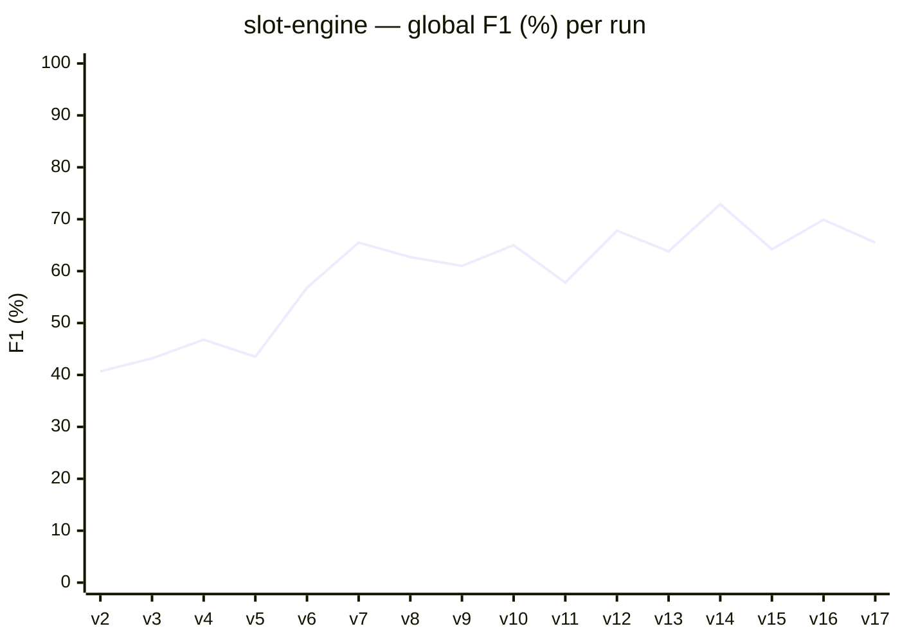
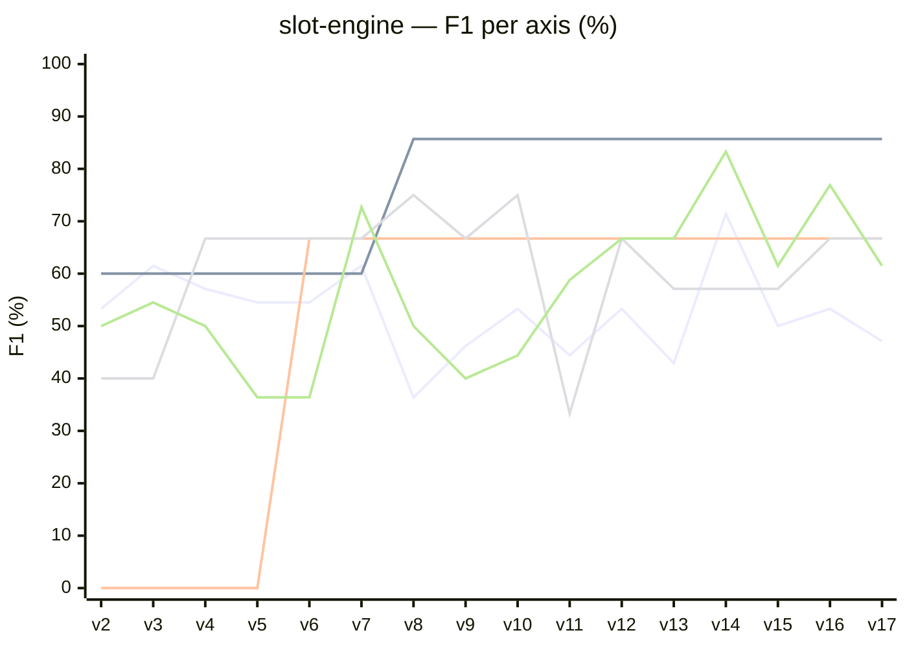

# slot-engine — bench results

Detailed progression of Anatoly scores on the `slot-engine` fixture (27 cataloged defects across 5 scored axes — correction:7, utility:7, duplication:4, overengineering:4, best-practices:5; tests and documentation intentionally excluded — the fixture ships no test suite or JSDoc by design).

Each run is a single execution of `anatoly run` against `catalog/slot-engine/project/`, scored via `anatoly-bench score`. Per-run JSON + Markdown baselines are in [`baselines/`](../baselines/).

## Global F1 progression

The 9pp spread across v13 → v15 (63.8% → 72.9% → 64.2%) on a fixed code state defines the **run-to-run LLM noise floor**. Treat any single-run delta below this band as noise.

## Per-axis F1 progression

Five lines overlaid — Mermaid auto-assigns colors and shows the axis name as legend on each line. Crosswise patterns to note: **utility** is a step from 60% to 85.7% at v8 (per-axis triage fix). **duplication** is a step from 0 to 66.7% at v6 (tier-1 invariant fix), flat since. **correction** is the most volatile, peaking at v14 (71.4%) and dipping at v8 (36.4%), v17 (47.1%) — sensitive to prompt + context-rot defenses. **best-practices** has the widest dynamic range (36.4% to 83.3%) — runs hot when industry-knowledge prompting triggers (v11+).

## Tabular baseline

Kept for data extraction / regression diffs. Bold marks historical peaks.

| Run | Date | Global F1 | correction | utility | duplication | overengineering | best-practices |
|-----|------|----------:|-----------:|--------:|------------:|----------------:|---------------:|
| v1* | 2026-04-24 | 27.7% | 53.3% | 60.0% | 0.0% | 0.0% | 40.0% |
| v2  | 2026-04-24 | 40.7% | 53.3% | 60.0% | 0.0% | 40.0% | 50.0% |
| v3  | 2026-04-24 | 43.2% | 61.5% | 60.0% | 0.0% | 40.0% | 54.5% |
| v4  | 2026-04-24 | 46.8% | 57.1% | 60.0% | 0.0% | 66.7% | 50.0% |
| v5  | 2026-04-24 | 43.5% | 54.5% | 60.0% | 0.0% | 66.7% | 36.4% |
| v6  | 2026-04-24 | 56.8% | 54.5% | 60.0% | **66.7%** | 66.7% | 36.4% |
| v7  | 2026-04-26 | 65.5% | 61.5% | 60.0% | 66.7% | 66.7% | **72.7%** |
| v7† | 2026-04-26 | 66.9% | 61.5% | 66.7% | 66.7% | 66.7% | 72.7% |
| v8  | 2026-04-27 | 62.7% | 36.4%‡ | **85.7%** | 66.7% | 75.0% | 50.0%‡ |
| v9  | 2026-04-27 | 61.0% | 46.2% | 85.7% | 66.7% | 66.7% | 40.0% |
| v10 | 2026-04-28 | 65.0% | 53.3% | 85.7% | 66.7% | 75.0% | 44.4% |
| v11 | 2026-04-28 | 57.8% | 44.4% | 85.7% | 66.7% | 33.3%§ | 58.8% |
| v12 | 2026-04-28 | 67.8% | 53.3% | 85.7% | 66.7% | 66.7% | 66.7% |
| v13 | 2026-05-06 | 63.8% | 42.9% | 85.7% | 66.7% | 57.1% | 66.7% |
| **v14**¶ | 2026-05-06 | **72.9%** | **71.4%** | 85.7% | 66.7% | 57.1% | **83.3%** |
| v15 | 2026-05-06 | 64.2% | 50.0% | 85.7% | 66.7% | 57.1% | 61.5% |
| **v16** | 2026-05-07 | **69.9%** | 53.3% | 85.7% | 66.7% | **66.7%** | 76.9% |
| v17  | 2026-05-12 | 65.5% | 47.1%◊ | 85.7% | 66.7% | 66.7% | 61.5% |

\* v1 used a different scoring scope (7 axes vs 5). Comparisons are meaningful from v2 onwards.
† v7 re-scored against the v8 catalog (DEAD-WILD-HELPER + DEAD-LINE-WIN added) for an apples-to-apples delta against v8.
‡ v8 lost three findings vs v7 to LLM variance (INV-WEIGHTS, INV-BETCAP on correction; BP-STRING-THROW on best-practices). The structural improvement is the **+19pp on utility** (DEAD-TYPE, DEAD-WILD-HELPER, DEAD-LINE-WIN all caught after the triage fix).
§ v11 saw an OE collapse where the LLM agglomerated three over-engineered patterns into a single finding on `engine.ts::spin` instead of flagging each at its source file. The next commit added an explicit "flag the source, not the consumer" rule to the correction, OE, and best-practices prompts; v12 restored OE to 66.7% with 100% precision.
¶ v14 is the historical best — same Anatoly state as v13/v15, but the LLM converged on INV-FREESPIN, INV-WEIGHTS, and BP-STRING-THROW that the sister runs missed. The 9pp spread across v13–v15 (63.8% → 72.9% → 64.2%) is pure run-to-run LLM variance on a fixed code state, which sets the noise floor for any single-run comparison.
◊ v17 ran on the epic-52/53/54 stabilization branch. The correction regression (-6pp vs v16) traces to the cross-project sharing rollback for code-derived caches: `renderReferenceDocsContext` now marks only human-authored documentation as authoritative, so the internal `.anatoly/docs/` (generated from code) no longer feeds correction as ground truth. This closes the context-rot loop at a measurable cost on this fixture. Global F1 stays inside the v13–v16 variance band (63.8–72.9%).

## Anatoly fixes landed during the bench lifetime

- **v6 — duplication tier-1 invariant** ([r-via/anatoly@44f0617](https://github.com/r-via/anatoly/commit/44f0617)). Tier-1 refinement was overriding the LLM's `DUPLICATE` verdict whenever the underlying RAG embedding score stayed below 0.68, even when the LLM had committed to a concrete `duplicate_target`. The bench surfaced the bug; the fix landed; v6 measured the gain (duplication 0% → 66.7%).
- **v8 — per-axis triage policy** ([r-via/anatoly@b784caf](https://github.com/r-via/anatoly/commit/b784caf)). Triage's `skip` tier was binary: type-only / trivial / barrel-export files bypassed every axis with blanket safe defaults, including utility. Files like `src/types.ts` (an exported type alias never imported) silently classified as `USED`, and a 4-line `src/wild.ts` never saw the LLM at all. The fix splits triage decisions per-axis, consults the usage graph for utility on skipped files, and routes trivial files through `correction`/`duplication`/`utility` evaluators. utility 66.7% → 85.7%.
- **v9 — multi-defect findings per symbol** ([r-via/anatoly@75cdf08](https://github.com/r-via/anatoly/commit/75cdf08)). The correction axis used to return one record per symbol — symbols carrying several distinct defects collapsed into a single prose detail, leaving downstream consumers no way to count the second defect. Schema now supports an optional `findings` array per symbol; the shard renderer emits one row per finding.
- **v10 — internal-docs injection into business-logic axes**. Anatoly's existing `.anatoly/docs/` scaffolder produces high-quality, agent-curated business context that previously only fed the `documentation` axis. The fix injects it into `correction`, `best_practices`, and `overengineering` user messages, with a prompt rule instructing the model to treat documented invariants as authoritative ground truth. correction 46.2% → 53.3%; INV-ROUND now detected.
- **v11 — industry-knowledge prompting** ([r-via/anatoly@d0068a2](https://github.com/r-via/anatoly/commit/d0068a2)). The LLM had pretrained knowledge of industry-specific correctness rules (gaming RNG must be certifiable; monetary code must use exact arithmetic; deprecated cryptographic primitives) but did not volunteer it without prompting. Added a rule to the correction and best-practices system prompts inviting the model to apply such rules when it can confidently infer the project's domain, with a discipline clause requiring citation of both the inferred domain and the rule. best-practices recall hit 100% (5/5) for the first time; BP-RNG (`Math.random()` for gaming) detected.
- **v12 — anti-collapse rules + temperature pin** ([r-via/anatoly@d8fd931](https://github.com/r-via/anatoly/commit/d8fd931), [r-via/anatoly@ebb8505](https://github.com/r-via/anatoly/commit/ebb8505)). Two changes: (1) added a "flag the source of a defect, not its consumer" rule to the correction, overengineering, and best-practices prompts — the LLM was previously free to choose between flagging one consumer-side finding or N source-side findings, producing run-to-run-flapping verdicts. (2) Pinned `temperature: 0` in the Vercel SDK transport (Anthropic Claude Agent SDK and Gemini CLI do not expose temperature, so subscription-mode calls remain at the SDK default). overengineering 33.3% → 66.7% with 100% precision; global F1 jumped from 57.8% (v11) to 67.8% (v12).
- **v13 / v14 / v15 — variance triplet (no Anatoly change)**. Three back-to-back runs on the same code and same Anatoly state, scored on the new score-output metadata (commit/duration/cost/tokens surfaced via [r-via/anatoly-bench@e743a53](https://github.com/r-via/anatoly-bench/commit/e743a53)). The 9-point spread (63.8% / 72.9% / 64.2%) is the run-to-run LLM noise floor: same prompts, same code, different convergence on INV-FREESPIN, INV-WEIGHTS, BP-STRING-THROW from one run to the next. Treat any single-run delta below this band as noise.
- **v16 — local sidecar architectural cleanup + per-axis bench metrics** ([r-via/anatoly@f8e52e8](https://github.com/r-via/anatoly/commit/f8e52e8), [r-via/anatoly@a515eb2](https://github.com/r-via/anatoly/commit/a515eb2), [r-via/anatoly@c58fae8](https://github.com/r-via/anatoly/commit/c58fae8), [r-via/anatoly-bench@f892b0d](https://github.com/r-via/anatoly-bench/commit/f892b0d)). Three Anatoly fixes plus one bench feature: (1) unified the `local-advanced` config-facing name with the `anatoly-local` runtime registry entry — the v3 config path was forwarding the user's placeholder `base_url: http://localhost:8082/v1` into the connectivity probe and the SDK call, both of which were supposed to use the per-axis URLs (`:11437` code / `:11438` NLP) hardcoded in `KNOWN_EMBEDDING_PROVIDERS`. (2) Propagated input/output/cache tokens from the agentic SDK call through `Tier3 QueryResult → ShardResult → Tier3Result → RefinementResult → recordLlmCost`, so `phaseStats.refinement` now reports real token counts instead of zeros. (3) Skipped the GGUF connectivity probe at run start (saves a 30–120 s container swap that was reduplicating the warm-up the indexer would do anyway). On the bench side, `score` now surfaces per-axis Time / Cost / Output tokens columns next to F1 — see the v16 baseline below for the new layout. F1 settled at 69.9%, inside the v13–v15 variance band; the run is qualitatively similar to v12 with INV-WEIGHTS recovered and INV-FREESPIN lost (net-zero on correction, +10pp on best-practices vs v12 from a clean refinement pass).
- **v17 — epic 52/53/54 stabilization**. Big multi-epic landing: (1) **Epic 54** documentation overhaul — `documentation.reference.paths` + `documentation.internal.mode` become required (no-magic config), split between `renderReferenceDocsContext` (human-authored = authoritative) and `renderInternalDocsContext` (code-derived = non-authoritative weak context), `doc_divergence` findings emitted transversally by correction/best-practices/overengineering/tests when code contradicts reference, lite/full/off modes for internal-doc generation, 3-way coherence in full mode. (2) **Epic 52** path layout corrections — reviews/refinements/nlp-summaries rolled back from cross-project `shared/` to project-local `cache/` (multi-tenant safety: shared/ is for provider/lang/product-public content only — pricing sources, grammars, models). `pricing/normalized.json` moves to `cache/` (project-config-keyed). Auto-migration in `bootstrapAnatoly` for legacy state (`.anatoly/{docs,rag,calibration.json,deliberation-memory.json}` → canonical homes). Legacy `~/.anatoly/models/*.gguf` symlinked under `shared/models/gguf/` (zero-mv migration). Sandbox-aware bootstrap: no implicit `~/.anatoly/` creation. (3) **Epic 53** wired the ndjson events (`phase_start`/`phase_end`/`file_review_end`/`estimate_total`) that `anatoly attach` consumes for live rendering. (4) Fixed `--no-cache` to **bypass** cache in-memory instead of `clearCache()` mid-run (the old behavior wiped freshly-built tasks/RAG/progress.json, leaving review loop with zero files). Global F1 65.5% — within v13–v16 variance band but ~4pp under v16; correction takes the hit (47.1%) because internal-doc context is no longer authoritative for flagging bugs. Net design improvement, mild bench cost.

## Per-axis execution profile (v17 — 8m 36s wall · $7.09 API)

| Axis | F1 | Time | Cost | Out tokens |
|------|---:|-----:|-----:|-----------:|
| correction | 47.1% | 11m 21s | $1.77 | 43K |
| utility | 85.7% | 48s | $0.06 | 8K |
| duplication | 66.7% | 1m 19s | $0.07 | 10K |
| overengineering | 66.7% | 3m 13s | $0.79 | 10K |
| best-practices | 61.5% | (n/a)† | — | — |

† best-practices `axisStats` not populated in `run-metrics.json` on v17 — likely a regression in the epic 52 path migration. F1 itself is correctly computed from the review files. To investigate.

## Remaining misses (v16 catalog, still applicable to v17)

Eight defects from the catalog that Anatoly does not yet detect on this fixture:

| Axis | ID | Difficulty | Defect |
|------|----|----|--------|
| correction | INV-WILD | hard | wild multiplier stacks `(1+wc)·2^wc` instead of `2^wc` (wild.ts) |
| correction | INV-FREESPIN | medium | free-spin retrigger does not decrement remaining count (newly missed in v16; was caught in v12 / v14) |
| correction | INV-JACKPOT | medium | jackpot triggers on 4 diamonds anywhere instead of 5 on middle row |
| utility | DEAD-DEBUG-BRANCH | medium | `if (DEBUG_MODE)` branch with `DEBUG_MODE = false` const — statically unreachable |
| duplication | DUP-PAYOUT | medium | `legacy.ts::computeLegacyPayout` duplicates `engine.ts::computePayout` — duplication axis never runs on legacy.ts (`fileHasSimilarityCandidates` short-circuits before the LLM can vote) |
| duplication | DUP-WILD | hard | wild multiplier formula duplicated inline in `engine.ts::evaluateLine` vs the helper in `wild.ts::applyWildBonus` (sub-symbol granularity) |
| overengineering | OVER-FACTORY | medium | `AbstractReelBuilderFactory` abstract for one concrete subclass (varies with LLM choice run-to-run) |
| overengineering | OVER-STRATEGY | medium | `SpinStrategy` abstraction for a single used implementation (needs class-hierarchy + use-site cross-reference) |

These cluster around five themes:

- **Project-private design conventions** (INV-WILD, INV-JACKPOT, INV-WEIGHTS) — not in the README, not in `.anatoly/docs/`. Need user-provided invariants (ROADMAP item 5c).
- **Sub-symbol granularity** (DUP-WILD inline, DEAD-DEBUG-BRANCH branch-level) — defects that sit below the named-symbol level (ROADMAP item 6).
- **Upstream duplication-axis short-circuit** (DUP-PAYOUT) — when `fileHasSimilarityCandidates` returns false on a file, the LLM never votes on duplication for any of its symbols. Distinct from item 3 (which fixed the tier2 silencing of an existing DUPLICATE verdict on DEAD code) — this is gating *whether* the verdict gets emitted in the first place.
- **Hierarchy + usage cross-reference** (OVER-FACTORY, OVER-STRATEGY) — overengineering needs to count concrete subclasses + their use sites (ROADMAP item 4).

A prioritized roadmap of the Anatoly evolutions needed to close these gaps lives in [../ROADMAP.md](../ROADMAP.md). The original 3-run feedback report (more historical context) is in [01-feedback-anatoly.md](./01-feedback-anatoly.md).
