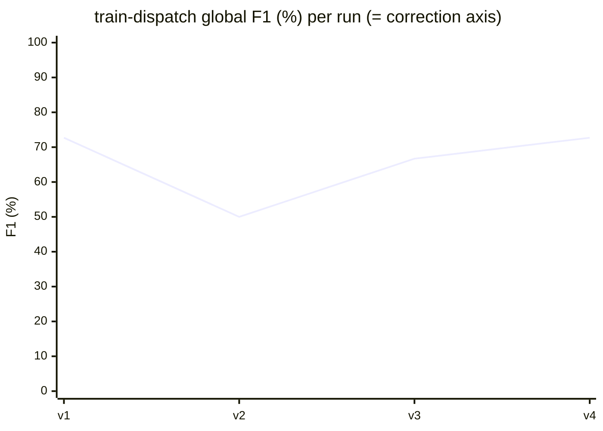

# train-dispatch: bench results

Detailed progression of Anatoly scores on the `train-dispatch` fixture (6 cataloged defects on a **single scored axis**: correction). This is the behavioural-invariant companion to `slot-engine`: where slot-engine ships numeric and structural defects across five axes, train-dispatch ships defects that only reveal themselves as violations of properties over an execution (liveness, mutual exclusion, ordering, conservation, temporal separation). The fixture scores correction only on purpose, so **global F1 equals the correction-axis F1**; every other axis is excluded (the project ships no tests, almost no documentation, and the noise modules are intentionally clean).

Each run is a single execution of `anatoly run` against `catalog/train-dispatch/project/`, scored via `anatoly-bench score`. Per-run JSON + Markdown baselines are in [`baselines/`](../baselines/).

## The six cataloged defects

Ordered by increasing difficulty. All six live on the correction axis; all expect verdict `NEEDS_FIX`.

| ID | Difficulty | Module | Invariant violated |
|----|------------|--------|---------------------|
| INV-DWELL | trivial | timetable.ts (DWELL_TICKS) | `DWELL_TICKS = 6` contradicts the README-documented dwell of 2 ticks |
| INV-PRIORITY | medium | priority.ts (compareTrains) | comparator orders by train id, not priority class, so express does not pre-empt local |
| INV-HEADWAY | medium | signals.ts (canEnterBlock) | strict `>` under-enforces `MIN_HEADWAY`; a follower enters too soon |
| INV-CONSERVATION | medium | dispatcher.ts (runSchedule) | a dispatched train is not removed from the ready queue, so it arrives twice |
| INV-MUTEX | hard | interlocking.ts | occupancy guard checks the wrong block; two trains share one block on one tick |
| INV-DEADLOCK | hard | interlocking.ts | section blocks acquired in route order, not fixed order, so eastbound and westbound circular-wait |

INV-MUTEX and INV-DEADLOCK both live in `interlocking.ts` (different symbols), which makes that one file carry two of the three hardest defects.

## Global F1 progression

The fixture is brand new (all four runs are from 2026-06-15), so unlike the long slot-engine history there is no frozen-surface era yet: the **code surface itself moved between v1 and v4** as the Evolve-generated fixture converged on its final shape (v1 `e3d332c` → v2 `efb52c2` → v3/v4 `60bdb75`). The single-axis design means the entire F1 signal comes from the six correction defects, with no cross-axis averaging to dampen run-to-run swing: a single caught-or-missed defect moves global F1 by roughly 10 to 12 points. v2's dip to 50.0% is the clearest illustration: one extra miss (INV-HEADWAY) plus two extra false positives on the same draw, against a code state that was still settling.

## Tabular baseline

| Run | Date | Commit | Project @ | Global / correction F1 | Precision | Recall | TP | FP | FN | Duration | Cost |
|-----|------|--------|-----------|-----------------------:|----------:|-------:|---:|---:|---:|---------:|-----:|
| v1 | 2026-06-15 | `94406c2` | `e3d332c` | 72.7% | 80.0% | 66.7% | 4 | 1 | 2 | 3m 21s | $1.24 |
| v2 | 2026-06-15 | `94406c2` | `efb52c2` | 50.0% | 50.0% | 50.0% | 3 | 3 | 3 | 3m 27s | $1.06 |
| v3 | 2026-06-15 | `94406c2` | `60bdb75` | 66.7% | 66.7% | 66.7% | 4 | 2 | 2 | 3m 10s | $0.85 |
| **v4** | 2026-06-15 | `c56a3e4` | `60bdb75` | **72.7%** | 80.0% | 66.7% | 4 | 1 | 2 | 2m 47s | $0.83 |

v1 and v4 tie at the current best (72.7%, 4 TP / 1 FP / 2 FN). v4 runs on the same frozen project state as v3 (`60bdb75`); the Anatoly commit is the only difference (`c56a3e4`, the declaration-indexing change described below).

## What changed per run

- **v1 (`e3d332c`)** — first scored run on the initial Evolve output. Caught four of six: INV-PRIORITY, INV-HEADWAY, INV-MUTEX, INV-CONSERVATION. Missed INV-DWELL (trivial) and INV-DEADLOCK (hard). One false positive on `timetable.ts` (TIMETABLE): the auditor read the `T6_LOC` route as a wrong-direction defect when the contra-flow is part of the intended deadlock scenario, not a separate bug.
- **v2 (`efb52c2`)**: a fixture revision while the project was still converging. The draw also lost INV-HEADWAY and emitted three false positives (all clustered on `timetable.ts` TIMETABLE), dropping precision to 50.0%. This is the low point of the series and reflects both an unsettled code surface and an unlucky LLM draw on a single-axis fixture where one finding is worth ~12 points.
- **v3 (`60bdb75`)**: the project reaches its final shape. Back to four catches (INV-HEADWAY recovered), but two false positives land on the clean noise modules (`network.ts` ADJACENCY and `routing.ts` shortestPath), the modules the fixture ships specifically to test precision. F1 66.7%.
- **v4 (`60bdb75`, Anatoly `c56a3e4`)**: same frozen project as v3; the only change is the Anatoly-side **declaration-indexing fix** (branch `rag-index-declarations`). Best-of-series 72.7% with a single false positive (`dispatcher.ts` runSchedule, a gate-ordering observation). See the dedicated section below for why this run matters beyond the score.

## Anatoly fix landed during the bench lifetime

- **v4 — RAG declaration indexing (`c56a3e4`, branch `rag-index-declarations`).** Before this change, the RAG indexer only built cards for function-like symbols. A **data-only file** (top-level `const` / `type` / `enum` with no functions, e.g. `src/timetable.ts`) stored no NLP vector, so `getAverageNlpVectorByFile` returned null and **zero reference-doc fragments were routed to it**. The fix indexes non-function declarations as a new card `kind: 'declaration'` with an AST-synthesized summary (no LLM call), included in the per-file NLP average but excluded from code-similarity / duplication search. The bench run proves the retrieval hole is closed: the `timetable.ts` correction review now carries `reference_source: README.md#Timing` and `reference_excerpt: "A station dwell is 2 ticks..."`, which was impossible before the fix (the data-only file could never reach the README).

## Why INV-DWELL is still missed (retrieval fixed, classification gap remains)

INV-DWELL is the trivial defect (`DWELL_TICKS = 6` versus a README-documented 2 ticks) and yet it is missed on **every** run, v1 through v4. The v4 declaration-indexing fix removed the suspected cause (the README never reached the data-only file), and the run confirms the README excerpt now arrives at the `timetable.ts` review. The contradiction is detected: it surfaces as a `doc_divergence` plus a `documentation: UNDOCUMENTED` finding.

But the **correction-axis verdict on `DWELL_TICKS` is `OK`**, with the rationale "No code-level defect; value diverges from README (see doc_divergences)." The axis classifies a value that contradicts the documented spec as a documentation divergence rather than a correction `NEEDS_FIX`. Because the catalog files INV-DWELL as axis `correction` / `NEEDS_FIX`, the divergence classification scores no credit.

So the remaining INV-DWELL gap is a **correction-axis classification policy**, not a retrieval gap. The retrieval foundation is now in place; the open decision (owner) is whether the correction axis should treat a constant that contradicts a documented invariant as a correctness defect in its own right, or accept the divergence classification. This is the same recurring theme as the slot-engine arbitration loop: a contradiction can be detected and surfaced without folding into the scored correction axis.

## Remaining misses (v4, final project state `60bdb75`)

| Axis | ID | Difficulty | Status | Defect |
|------|----|------------|--------|--------|
| correction | INV-DWELL | trivial | **always missed** | `DWELL_TICKS = 6` contradicts the documented 2-tick dwell; detected but classified as a doc-divergence (verdict OK), not a correction NEEDS_FIX (see section above) |
| correction | INV-DEADLOCK | hard | **always missed** | section blocks reserved in route-traversal order instead of a fixed global order, so eastbound `T5_EXP` and westbound `T6_LOC` circular-wait on `bS1`/`bS2` and both strand; requires reasoning about acquisition order across two trains over the execution trace |
| correction | INV-HEADWAY | medium | variance | strict `>` under-enforces `MIN_HEADWAY`; caught v1/v3/v4, missed v2 |

INV-PRIORITY, INV-MUTEX, and INV-CONSERVATION are caught on every run. The two persistent misses cluster around two themes:

- **Cross-axis classification** (INV-DWELL): the contradiction is detected but lands on the documentation axis as a divergence rather than on the scored correction axis as a defect. Closing this is a correction-axis policy decision, not a detection improvement.
- **Multi-train execution-trace reasoning** (INV-DEADLOCK): a circular wait only manifests when two trains approaching a single-track section from opposite directions are considered together over time. Surfacing it from static review requires reasoning about acquisition order across trains, the hardest defect in the fixture and the one no run has cracked.

The original slot-engine results (the multi-axis fixture this one complements) are in [02-slot-engine-results.md](./02-slot-engine-results.md). The fixture spec is in [../catalog/train-dispatch/SPEC.md](../catalog/train-dispatch/SPEC.md).
